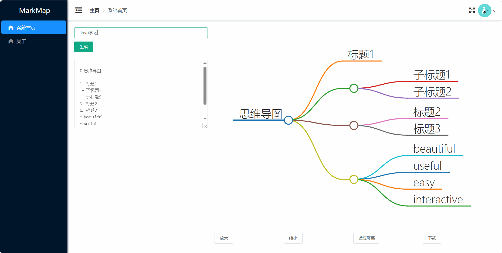

# GPT 思维导图生成器

> 本项目完全开源
> 如果觉得不错麻烦帮忙点一次`Star⭐️`

## 项目简介

**MarkMap-OpenAi-ChatGpt** 是一个基于Vue.js的思维导图生成工具，用户可以通过输入标题或内容来生成思维导图。应用集成了`markmap-lib`与`markmap-view`库，支持将思维导图可视化，并且提供了对导图的缩放、适应屏幕等功能。用户还可以将生成的思维导图导出为PNG、SVG、JPEG等格式。

该项目适合用于快速整理想法、学习笔记、项目规划等场景。通过简单的输入内容，即可得到一个直观的思维导图，并可持续扩展、下载和分享。

## 功能特性

- 输入标题或内容，生成思维导图
- 支持连续问答模式，基于已有内容深入生成
- 思维导图的缩放、适应屏幕等视图控制功能
- 导出为多种图片格式：PNG、JPEG、SVG
- 使用现代Web技术：Vue.js、Element UI、markmap-lib

## 项目结构
```
├── public
│ └── index.html
├── src
│ ├── assets
│ ├── components
│ │ └── MarkdownRenderer.vue
│ ├── views
│ │ └── Home.vue
│ │ └── About.vue
│ ├── App.vue
│ └── main.js
├── .env
├── .gitignore
├── package.json
├── README.md
└── vue.config.js
```
## 项目预览


## 在线演示

你可以通过以下链接查看在线演示：
- [GitHub Pages Demo](https://your-username.github.io/MarkMap-OpenAi-ChatGpt/)
- [Netlify Demo](https://your-netlify-demo-link)
- [Vercel Demo](https://your-vercel-demo-link)

---

## 联系作者
- **邮箱**：pastking@ltde.cn
- **公众号**：昔尘科技
---
## 部署与运行

### 环境要求

在运行和部署此项目之前，确保你的环境已经安装了以下工具：

- **Node.js** (推荐版本：v14+)
- **npm** (Node 包管理工具)
- **Git** (版本控制工具)

### 克隆项目
首先，使用以下命令将项目代码克隆到本地：

```bash
git clone https://github.com/PastKing/MarkMap-OpenAi-ChatGpt.git
cd MarkMap-OpenAi-ChatGpt
```

### 安装依赖
进入 `MarkMap-OpenAi-ChatGpt` 目录后，运行以下命令安装项目所需的依赖：

```bash
npm install
```

### 本地运行

安装完依赖后，使用以下命令启动本地开发服务器：

```bash
npm run serve
```

在浏览器中访问`http://localhost:7000`，即可查看项目。

### 项目构建

如果需要将项目部署到生产环境，可以通过以下命令构建项目：

```bash
npm run build
```

构建后的静态文件会生成在`dist/`目录下，可以将该目录内容上传到任何静态服务器或托管平台。

---

## 部署到GitHub Pages

GitHub Pages 是一个方便的托管静态网站的平台，适合用来发布Vue项目。

### 第一步：构建项目

确保项目已经成功构建，并生成了`dist/`文件夹：

```bash
npm run build
```

### 第二步：将项目推送到`gh-pages`分支

可以使用`gh-pages`插件来简化这个过程。首先安装`gh-pages`插件：

```bash
npm install --save-dev gh-pages
```

然后在`package.json`中添加以下脚本：

```json
{
  "scripts": {
    "deploy": "gh-pages -d dist"
  }
}
```

接下来运行以下命令，将`dist/`目录推送到GitHub的`gh-pages`分支：

```bash
npm run deploy
```

### 第三步：启用GitHub Pages

1. 打开你的GitHub仓库页面，点击 **Settings**。
2. 在左侧栏中选择 **Pages**。
3. 选择源为`gh-pages`分支，保存设置。

几分钟后，你的项目将会在`https://your-username.github.io/MarkMap-OpenAi-ChatGpt/`上访问。

---

## 部署到Netlify

Netlify 是一个强大且易用的托管平台，特别适合前端项目的部署。

### 第一步：连接GitHub仓库

1. 登录 [Netlify](https://www.netlify.com/) 并点击 **New site from Git**。
2. 选择 **GitHub**，授权Netlify访问你的GitHub账户。
3. 选择你的 **MarkMap-OpenAi-ChatGpt** 仓库。

### 第二步：配置构建设置

在Netlify的项目配置页面中，设置以下内容：

- **Build Command**: `npm run build`
- **Publish Directory**: `dist/`

然后点击 **Deploy**，Netlify 会自动构建并托管你的项目。

### 第三步：获取部署链接

项目部署完成后，Netlify 会提供一个访问链接。你可以自定义该链接或使用Netlify提供的默认域名。

---

## 部署到Vercel

Vercel 是另一个受欢迎的前端部署平台，具有快速部署和全局CDN支持的特点。

### 第一步：连接GitHub仓库

1. 登录 [Vercel](https://vercel.com/) 并点击 **New Project**。
2. 选择 **Import Git Repository**，并选择你的 **MarkMap-OpenAi-ChatGpt** 仓库。

### 第二步：配置部署设置

Vercel会自动识别Vue项目，默认的设置无需更改：

- **Build Command**: `npm run build`
- **Output Directory**: `dist/`

点击 **Deploy** 按钮，Vercel 会开始构建并部署项目。

### 第三步：获取Vercel URL

部署完成后，Vercel 会为你的项目提供一个唯一的URL，你可以使用该链接分享或自定义为你自己的域名。


## 常见问题

### 1. 如何修改API请求的URL和密钥？
你可以在项目的环境配置文件`.env`中配置API的请求地址和密钥。使用以下命令创建并编辑环境文件：

```bash
cp .env.example .env
```

然后在`.env`文件中修改如下内容：

```bash
VUE_APP_API_BASE_URL=https://your-api-endpoint
VUE_APP_API_KEY=your-api-key
```

### 2. 部署时出现构建错误如何处理？

- 确保Node.js版本符合要求（推荐v14+）。
- 检查项目的依赖是否正确安装，可以尝试删除`node_modules`文件夹并重新运行`npm install`。
- 确保在项目根目录下执行了`npm run build`。

---

## 贡献指南

欢迎任何形式的贡献，以下是贡献步骤：

1. **Fork** 本仓库
2. 创建你的 **feature 分支** (`git checkout -b feature/your-feature`)
3. 提交你的修改 (`git commit -m 'Add some feature'`)
4. 推送到分支 (`git push origin feature/your-feature`)
5. 创建一个新的 **Pull Request**

---

## 许可证

该项目基于 [MIT License](LICENSE) 许可证开源。你可以自由地使用、修改和分发此项目。

---

## 致谢

- 感谢 [markmap-lib](https://github.com/markmap/markmap) 提供的思维导图生成库。
- 感谢 Vue.js 和 Element UI 提供的强大框架。

---

此文档现已更新为包含进入 `vue` 子目录的操作步骤。如果项目目录结构或构建工具有变化，可以根据实际情况继续调整。


## 赞助/支持

